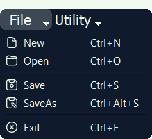

---
hide:
  - navigation
---

# Application Manual
??? warning "Warning for resolutions other than FullHD"
    This page was created on a 1080p monitor, and due to the picture alignment I suspect that the scaling for other resolution will be less than good. Sorry, but not much one can do about it.

## Interface
The final application interface is shown below. It consists of different sections which have thoughtfully been placed together to provide an intuitive and easy to use application. How to use these sections will be described, but first some short tips. 

If unsure about the model parameters, utilize the reference geometry in the top-middle frame. See which model is being worked on in the bottom left corner, if empty this suggest that the current model has not been saved. Resize the window by grabbing the bottom-right corner. Move the window by grabbing any non-interactive widget.

<figure markdown>
  { width="600" }
  <figcaption>Application interface</figcaption>
</figure>

{ align=left }
### Input
The input section is where the user enters its dimensional parameters, dam pressure and permeability by clicking within the field and typing. These are all used for both the regular and parameter computations. All values should be positive, `w` > `t` and `h` > `d` has to be fulfilled for the model to be valid. When performing a parameter study the requirements is expanded to, `h` > `d_end` > `d` for a study of depth and `w` > `t_end` > `t` for a study of thickness.

   
{ align=left }
### Utility
The utility section mainly concerns calculations. Determine the mesh element size with the sliding bar, smaller values correlate to a finer mesh and longer computation.
If a regular study is to be done press the Execute button, or use the keyboard shortcut ++ctrl+return++. When performing a parameter study, choose first the variable to study with the radio button. Then enter the end and amount of steps, consider the computation time and reduce either steps or increase element mesh size. To execute the parameter study click the Parameter Study button or the shortcut ++ctrl+alt+return++. To clear the canvas use the Clear Canvas button or the shortcut ++ctrl+c++.

    
{ align=left }
### Plotting
All buttons for plotting are found here, these can be repeatedly used to switch between all outputs. The only restriction is that a regular computation has to been made, or for the case of Maximum Flux a parameter study. Use the built in functionality of matplotlibs to zoom in on interesting regions, drag the geometry around or save the figures.

   
{ align=left }
### File
The file functionality has been designed to be easy to use. All filedialogs begin at the project folder, from which it is easy to access the predefined data folder. This folder contain two JSON files, both are safe to open even if one is from an older version. There is no need to worry about VTK-files cluttering the project folder, all VTK files are saved to a dedicated VTK folder which is created if it does not already exist. Be carful of using New since there is no warning of unsaved data, neither here or for any of the other method. Take note of the standardized keyboard shortcuts, they might come in handy.

## Examples
Examples from a parameter study for the default geometry are available within the the Examples folder in the project directory. Within this folder, a total of four animations are available. They visualize piezometric head and effective flux for studies of both dam thickness and width. An text file is also available with the chosen parameters, the input data.

There is two JSON files available in the data folder. One is newly saved model from the latest application version (7), this provides an alternative starting point for calculations compared to that of the default values. The other file is from an older application version (4) and can be used to verify that older models will not throw errors, but will inform the user of this fact.