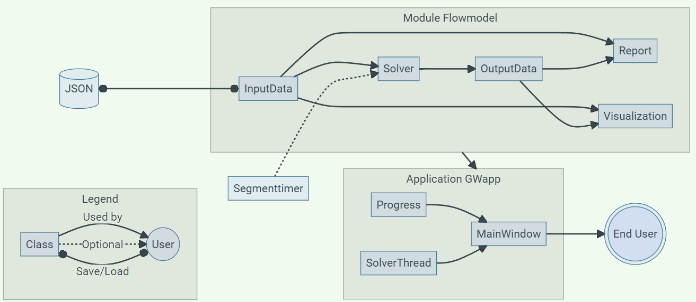
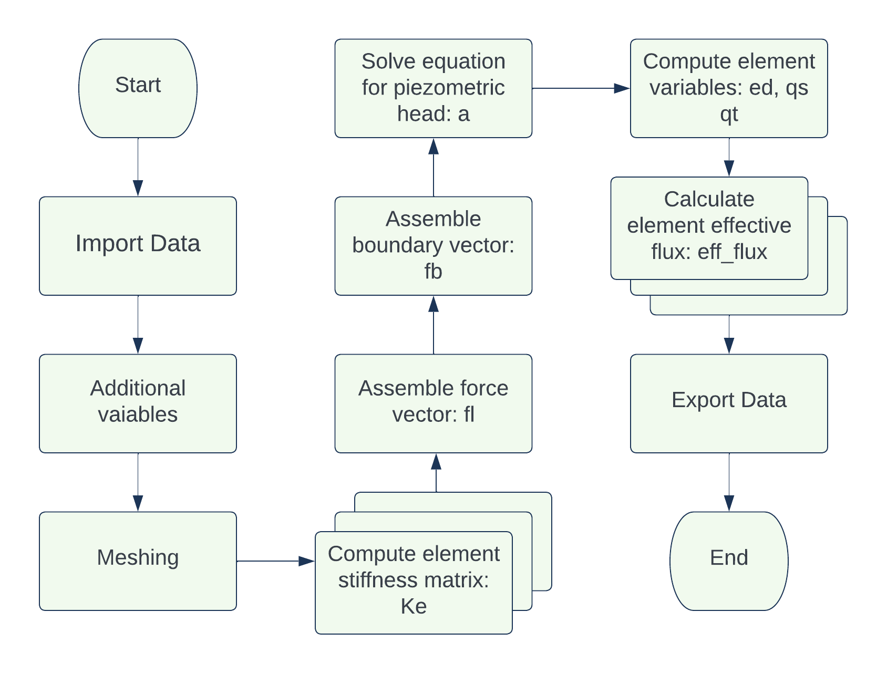
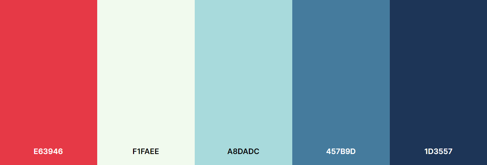
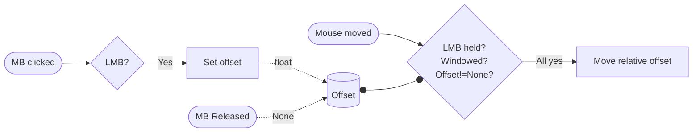

---
hide:
  - navigation
---

# Development
This page is dedicated to discuss and present how the program was built. It discusses the problems that was faced in development and also the expansions made outside the required functionality. All code is found under the Code Reference tab, all examples are found under the manual tabs.

## Structure
The development of this project was made through several iterative assignments, each building on the previous iteration. From the beginning the flowmodel module has been separated from the runnable scripts or applications. This is done in order to make it usable in general applications and not only the one application. At times this has complicated implementation of additional features, but it is worth the effort to keep the flowmodel module independent.

The module has been used several times with different scripts and applications, but in this final assignment it was used by a purpose built application by the name GWapp. This application is used by the end user, to interact with the module functionality and to visualize its results. Further, a single class module was used as a stopwatch for debugging purposes. All results can be saved and loaded with JSON files. How all these components relate to each other, was for the final version visualized with the flowchart below.

<figure markdown>
  { width="1000" }
  <figcaption>Flowchart of project structure</figcaption>
</figure>

## Flowmodel Module
As stated before, the flowmodel was designed to be an independent module. It was to contain classes and functions to perform finite element analysis on a groundwater flow of a simplified dam. While containing core features required by the assignments, it has been expanded slightly to get additional optional functionality that are utilized by the application.

### InputData
The `InputData` has gotten an additional attribute `el_size_factor` so that the maximal element size can be modified. This allows for the user to choose the accuracy and computation time, which is especially important when performing a parameter study. Additionally instead of using two attributes to know if which parameter to study, this program only uses one `dStudy` to check if d should be studied or not.

Exception handling was implemented for the file functionality methods to avoid common crashes. This was then connected to a return boolean which can be utilized to avoid running the statements that follow the function-call or to present error messages within the application.

The simplified dam structure geometry is constructed by the `geometry` method. This geometry only makes physical sense for a certain set of values where all parameters are larger than zero, `w` > `t` and `h` > `d`. Hence, the method `validModel` was implemented to check these requirements. Since some physical limitations are also valid for the parameter study, an equivalent method `validParam` was implemented to check if `h` > `d_end` > `d` for a study of depth and `w` > `t_end` > `t` for a study of thickness.

???+ warning "Warning for memory limit"
    While the two methods `validModel` and `validParam` checks for logical errors within the input data, they are not foolproof. Depending on the machine there is a limitation on memory usage which can be violated when one chooses very large widths `w` and heights `d`. A general guideline is to not overstep a width of 100 m and height of 50 m when using mesh element size of 0.5.

### OutputData
The `OutputData` class has a single functionality of storing different calculated values. While the application does not use all attributes, they are kept as another program might. Two additional attributes has been added to allow plotting of maximum effective flux for a parameter study, these are `range` and `max_flux`.

### Solver
Two new attributes were added to the `Solver` class, both has default values if nothing is declared in the constructor. The first attribute `basepath` is a base path used for export of VTK files. The second attribute `pg` is a progressbar which can be passed from the application in order have a semi-accurate progressbar. To only call progressbar methods when an attribute is defined, truncated if-statement is used. These use Python feature that non-empty/zero objects return `True` in combinations with logic operators.

``` py
# These are equivalent
argument and function()
if argument:
    function()
```

The `execute` method uses a typical finite element method scheme which is defined by the flowchart beneath. Most steps are performed with predefined methods contained within CALFEM for Python. This method is then used within the parameter study loop in the `executeParamStudy` method.

<figure markdown>
  { width="750" }
  <figcaption>Flowchart of finite element solver</figcaption>
</figure>

### Report
With the `Report` class the purpose is to present input and output data in a clear way from the attributes of `InputData` and `OutputData`. While the input data consists of mainly scalars, the output data contains large float type vectors and matrices which requires significant formatting. The results are displayed in tables for each node and for each element. As these tables can become massive, the scalar values are displayed first to be more easily available. The scalar output values are number of nodes, number of elements and the maximal effective flux.

### Visualization
To visualize output data, the class `Visualization` is used. This class creates figures and stores them as attributes. Originally all plots were plotted within separate windows, which is still the case for `showAll` which presents all figures. However, I wished to show figures within the application, a more difficult task than first thought. 

Since figures could not be simply returned, due to how matplotlib and CALFEM Visualisation handles figures. With research a promising backend PyQt class `FigureCanvasQTAgg` of matplotlib was found. Its objects are PyQt5 compatible and can render figures from matplotlib and by extension CALFEM Visualisation. Another highly useful method is `figure_widget` from CALFEM Visualisation, which takes a figure argument and returns a `FigureCanvasQTAgg` object.

The `FigureCanvasQTAgg` objects are also saved as attributes, hence also closed in `closeAll`. To keep the individual plotting functions independent of this new extension, the keyword argument `show` was added. When it has its default value of true, the figures are shown in their own windows, when it is assigned false it suppresses the figures from showing and returns a `FigureCanvasQTAgg` object.

## GWapp Application
The application is meant to connect the user with the flowmodel module, with an easy to use graphical interface. In this case we used the Qt framework to implement a graphical interface that could be used on any platform. 

### MainWindow
The `MainWindow` class contains the bulk of the application with the UI, functions and all connections between them. Most functions are have little to no content and only calls on methods from the flowmodel module. The UI is designed from the ground up and should contain everything a user might need, the user should not have to use the console apart from debugging.

#### Design
To ease the design process, the Qt Designer program is used which has real time previews and drag and drop features. However, not all features are available within the program and some tinkering had to be done with code using PyQt5.

The first iterations of the interface were disorganized and used layouts in a way that would bad for scaling. Through iterative development a system of nested layouts was used to achieve predictable behavior during scaling. Through experimentation with stylesheets, I put my novice CSS knowledge to use in changing colors, margins and borders.

With several different iterations of the interface and a better familiarity with Qt Designer, a new interface was designed. This time a more coherent [color palette](https://coolors.co/palette/e63946-f1faee-a8dadc-457b9d-1d3557) was used, seen below, alongside color-matched free to use icons from [flaticon](https://www.flaticon.com/uicons).

<figure markdown>
  { width="750" }
  <figcaption>Primary color palette</figcaption>
</figure>

Although my artistic merits are close to none, the result were much better. Nevertheless, both the menubar and the frame could not be modified to match the new design within Qt Designer. A custom topbar was designed with window buttons (minimize, maximize/restore and exit) and menu buttons (File and Utility), and the frame was removed with PyQt5 within the constructor.

Since Qt Designer is missing the ability to ad QMenus, these had to be constructed with PyQt5. This was done by defining a shared stylesheet, creating a QMenu with all wanted actions and then attaching the menu to the menu buttons. Each action were paired with both an icon and a keyboard shortcut.

Removing the frame there were no longer any grabbable surface to move or resize the window with. The solution for this was more complicated than expected and was inspired by a [stack overflow answer](https://stackoverflow.com/a/58902192) by user musicamante. After modification, all non-intractable (not Button, PlainTextEdit, Slider) became grabbable to move the window. The inner workings are illustrated with the flowchart below.



Still no borders were available to grip in order to resize the window. To remedy this, a QFrame was added to the bottom right corner to which QSizeGrip were attached which allowed for resizing when grabbed. For extra clarification, an icon were added and when hovered over, the cursor is changed and a tooltip appears.

While at it, the program icon was changed from the default Python executable to a custom made logo to represent the geometry. In order for the logo to be shown in windows, the application had to be assigned an unique application ID.

???+ warning "Waring for Mac and Linux"
    This program has been developed on machines using Windows, hence I have no idea if the program will run as intended on Linux or Mac. Since assigning an unique application ID is specific to Windows, the following line can be removed from `MainWindow.__init__` if the application is run in other platforms.
    ``` { .py .annotate }
    ctypes.windll.shell32.SetCurrentProcessExplicitAppUserModelID("GWapp")
    ```

#### Functionality
Within the constructor all intractable elements of the UI has to be connected to methods within the class. A lot of methods are created to handle all possible actions of the UI, although some short actions could be written with lambda functions. The methods are divided into a couple of categories:

UI methods is consist of the `maximize` method which works restores or maximizes the UI while changing some elements. It is accompanied by `exit` which prompts the user before the program is terminated and all progress is lost. 

Utility methods correlates to the methods used when performing a simulation or parameter study. The methods `onActionExecute` and `onExecuteParamStudy` both utilizes the validation methods of `InputData` before calculations. If the model is invalid, the user is prompted with the requirements and no calculations are made.

Input and output contains several updating and file-functionality methods. To begin with, the `updateControls` method puts `InputData` attributes into the controls while `updateModel` reads data from the controls and puts them into `InputData` attributes. For the latter, simple exception handling was used to catch when incorrect types are read. With `updateEnd` only the currently displayed end value is read and put into the corresponding `InputData` attribute. Lastly `updateName` extracts the model name from the path attribute and updates the name within the UI.

#### Report and Figures
A QTabWidget is used to utilize the same space for the report and figures. The report is changed with calls of `setPlainText()` on the UI QPlainTextEdit attribute and its tab is always opened after new calculations. For figures, an empty `FigureCanvasQTAgg` attribute was initiated and manual placed into the opposite tab.

In order to change the figure the method `updateCanvas` was implemented. This method uses the returned `FigureCanvasQTAgg` from the visualization methods to replace the previous canvas with `replaceWidget`. The method is accompanied by `clearCanvas`, which is connected to the clear canvas button.

An addition to all plotting methods is the usage of `message` which prompts the user that relevant result has not been calculated for plotting attempts.

### Progress
When the program was finished there was still some things that were printed to the console, which provided the user with valuable information. One of these were all status printouts of the `Solver` class. To make these available to the application an object had to be passed to the solver instance. At first this was done with the QPlainTextEdit meant for the report. While it was sufficient, it was clunky and not visually pleasing.

With the more familiarity with Qt from the design of the `MainWindow`, an initial design was made as an round window with percentage and current step on display. Originally the background was supposed to indicate the percentage by recoloring the background clockwise. This was done by changing the stylesheet, but proved unreliable with randomly occurring crashes. The design was then changed slightly and a fading display of previous steps were added.

A new class `Progress` that handles the progressbar inherits from `QMainWindow` and has two methods, one to update segment name and percentage, a second to close and reset the window. An object of this type is passed to the a `Solver` object which can set progress of regular calculations and parameter studies.

#### Study of computation time
The percentages of each step in the solver had to be set manually and it was quickly noted that the percentages varied as parameters were changed. In an effort to identify governing factors, an faulty assumption was made that a the relation could be derived by experimenting with parameters and graphing the results. 

For this purpose the `SegmentTimer` was implemented to act as a stopwatch. After gathering a data set and trying multiple methods to extract any relations, it was realized that it was an impossible task. The percentages was instead chosen to match the average of several runs with the default parameters.

### SolverThread
No modifications were made to the suggested `SolverThread` class used to create threads for the `execute` and `executeParamStudy` methods of the `Solver` class.

## Validation
In the earliest iteration of the program, the solver had to be validated by a similar calculation made with Matlab. Using a simple four element geometry with prescribed parameters, the results became identical apart from the amount of float points that was printed. These results are presented in the table beneath.

| _Input Data_ 	| **Python** 	| **Matlab** 	|
|---	|:---:	|:---:	|
| Thickness (t) [m]: 	| 1 	| 1 	|
| Permeability matrix (perm) [m/day]: 	| [[50.  0.]<br> [ 0. 50.]] 	| 50     0<br> 0    50 	|
| Loads (loads) [node, m^2/day]: 	| [[6, -400.0]] 	| 6  -400 	|
| Boundary conditions (bcs) [node, m]: 	| [[2, 60.0],<br> [4, 60.0]] 	| 2    60<br>4    60 	|
| Nodal coordinates (coord) [m]: 	| [[   0.    0.]<br> [   0.  600.]<br> [ 600.    0.]<br> [ 600.  600.]<br> [1200.    0.]<br> [1200.  600.]] 	|    0        0<br>   0      600<br> 600        0<br> 600      600<br>1200        0<br>1200      600 	|
| Degrees of freedom (dof) [idx]: 	| [[1]<br> [2]<br> [3]<br> [4]<br> [5]<br> [6]] 	| 1<br>2<br>3<br>4<br>5<br>6 	|
| Topology (edof) [node, node, node]: 	| [[1 4 2]<br> [1 3 4]<br> [3 6 4]<br> [3 5 6]] 	| 1     1     4     2<br>2     1     3     4<br>3     3     6     4<br>4     3     5     6 	|
| **_Output Data_** 	|  	|  	|
| Nodal piezometric head (a) [m]: 	| [[59.05882353]<br> [60.        ]<br> [58.11764706]<br> [60.        ]<br> [53.41176471]<br> [48.70588235]] 	| 59.0588<br>60.0000<br>58.1176<br>60.0000<br>53.4118<br>48.7059 	|
| Nodal reaction flux (r) [m^2/day]: 	| [[ 0.00000000e+00]<br> [ 2.35294118e+01]<br> [ 0.00000000e+00]<br> [ 3.76470588e+02]<br> [-2.27373675e-13]<br> [ 2.27373675e-13]] 	| 0.0000<br>23.5294<br>0.0000<br>376.4706<br>-0.0000<br>-0.0000 	|
| Elemental piezometric head (ed) [m]: 	| [[59.05882353 60.         60.        ]<br> [59.05882353 58.11764706 60.        ]<br> [58.11764706 48.70588235 60.        ]<br> [58.11764706 53.41176471 48.70588235]] 	| 59.0588   60.0000   60.0000<br>59.0588   58.1176   60.0000<br>58.1176   48.7059   60.0000<br>58.1176   53.4118   48.7059 	|
| Elemental volume flux (qs) [m^2/day]: 	| [[ 0.         -0.07843137]<br> [ 0.07843137 -0.15686275]<br> [ 0.94117647 -0.15686275]<br> [ 0.39215686  0.39215686]] 	|      0   -0.0784<br>0.0784   -0.1569<br>0.9412   -0.1569<br>0.3922    0.3922 	|
| Elemental hydraulic gradient (qt) [m]: 	| [[ 0.          0.00156863]<br> [-0.00156863  0.00313725]<br> [-0.01882353  0.00313725]<br> [-0.00784314 -0.00784314]] 	|       0    0.0016<br>-0.0016    0.0031<br>-0.0188    0.0031<br>-0.0078   -0.0078 	|
