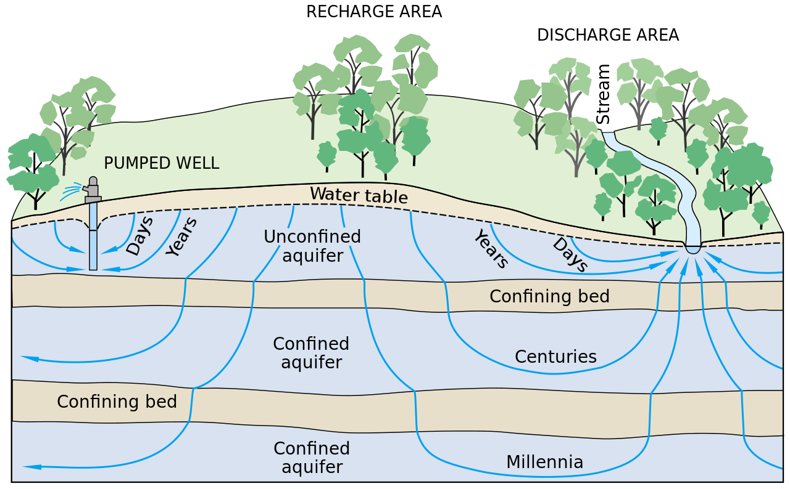
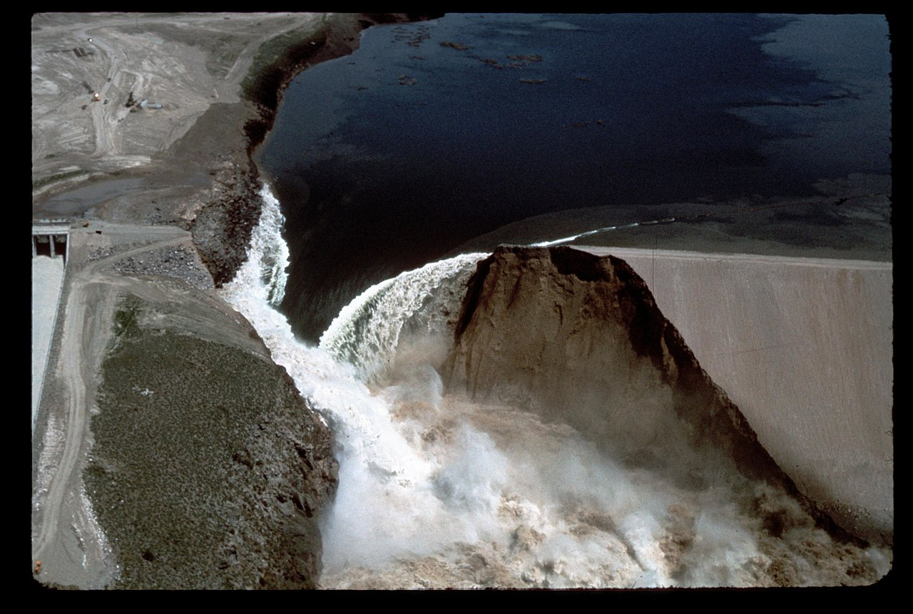

---
hide:
  - navigation
---

# Groundwater Flow

## Introduction
Besides glaciers and icecaps, most of the worlds freshwater is stored in the ground. This water is not only stored, but flows throughout the ground between the solid particles that composes it. Understanding how this water moves is vital since it is a valuable resource providing drinking and irrigation water the world over [1]. It is also a major factor in the construction of dams, which provide hydroelectric power the world over [2].

<figure markdown>
  { width="750" }
</figure>

  Illustration of groundwater flow. T.C. Winter, J.W. Harvey, O.L. Franke, and W.M. Alley (1998), <em>Groundwater flow</em>, https://commons.wikimedia.org/wiki/File:Groundwater_flow.svg [26/05/22].

## Mathematical model
Groundwater flow is a kind of seepage, movement of water in porous solids, studied within the field of soil mechanics and geology. A popular way to model complex seepage is with finite element methods, both for transient and steady state problems. In this project, we focus on latter for which the following is true [4, p.315]:

- Constant water pressure
- Constant water rate of flow
- Constant effective stress in soil
- No soil deformation

In order for an assumption of steady state to be valid, a number of assumptions has to be made. These are listed and explained beneath [4, p.316][5]:

- Saturated soil: Space between soil particles filled with fluid
- Homogenous soil: Characteristics independent of location
- Incompressible soil: Neither soil or water can be deformed or compressed
- Darcy's law is valid: Constitutive law of fluid flow through porous media
- Negligible capillary effects: Capillary action between soil particles and fluid causes diffusion

### Darcy's law
One-dimensional flow through a permeable medium, is governed by Darcy's law, which states that the flow rate $q$ is proportional to the derivative of the piezometric head $\phi$ by the coefficient of permeability $k$ [3, p.89].

$$
  q = -k \frac{d\phi}{dx}
$$

This equation is identical, apart from the quantities, to Fourier's law for heat flow. In fact the quantities of the constitutive law can be changed to fit a wide array of different physical problems, that have an analogous relation. By understanding one of the physical problems, one can understand principles of several others. As per the heat equation, the constitutive relation can be generalized to multiple dimensions [3, p.89].

$$
  \textbf{q} = -\textbf{D}\nabla\phi
$$

### Differential equation
Considering a arbitrary region with a fluid supply $Q$, assuming that the volume is conserved and an incompressible fluid, the governing differential equation can be formulated [3, p.88].

$$
  \text{div}(\textbf{D}\nabla\phi) + Q = 0
$$

### Boundary condition
To complete the model formulation one needs boundary conditions. These can be of two different types, essential boundaries with known piezometric head, and natural with prescribed flow normal to the boundary. For a impermeable surface, the essential boundary condition is zero.

## Finite element model
To formulate a finite element model of groundwater flow in two dimensions, the strong form is required. Hence, the differential equation is reduced to two dimensions and boundary conditions as $\mathcal{L}_h$ and $\mathcal{L}_g$ are arbitrary boundaries with natural and essential conditions respectively [3, p.83]. 

$$
  \begin{matrix}
    \text{div}(t\textbf{D}\nabla \phi) + tQ = 0 \hspace{10mm}  \text{in region } A \\
    q_n = \textbf{q}^\text{T}\textbf{n} = h \hspace{15mm} \text{on }\mathcal{L}_h\\
    \phi = g \hspace{33mm} \text{ on }\mathcal{L}_g
    \end{matrix}
$$

From the strong form a finite element model can be derived using the Galerkin method, which is presented beneath. For a complete derivation, the reader is referred to the FE formulation of two-dimensional heat flow in chapters 6,7 and 10 in <em>Introduction to the finite element method</em> [3].

$$
  \begin{matrix}
    \left(\int_A \textbf{B}^\text{T}\textbf{DB}t\text{d}A\right) \textbf{a} = \left(-\int_{\mathcal{L}_{h}}\textbf{N}^\text{T}ht\text{d}\mathcal{L} - \int_{\mathcal{L}_{g}}\textbf{N}^\text{T}q_{n}t\text{d}\mathcal{L}\right) + \int_A\textbf{N}^\text{T}Qt\text{d}A\\
    \hspace{18mm} \textbf{K} \hspace{15mm} \textbf{a} = \hspace{35mm} \textbf{f}_\text{b} \hspace{36mm} + \hspace{13mm} \textbf{f}_\text{l} \hfill
  \end{matrix}
$$

To solve the equation system for the nodal piezometric head $\textbf{a}$, one needs to assemble the global stiffness matrix $\textbf{K}$, the boundary vector $\textbf{f}_\text{b}$ and the load vector $\textbf{f}_\text{l}$.

## Applications
Understanding of groundwater flow and usage of corresponding finite element models proves useful in many cases. To give an introduction of the possible applications, two different examples are used.

### Drinking water
Groundwater accounts for roughly 30 percent of the worlds freshwater and is only beat by glaciers and icecaps. But unlike glaciers the water of liquid form and constitutes upwards of 99 percent of the worlds liquid freshwater. It is vital for billions of lives the world over, since it is the source of roughly half the worlds drinking water, 40 percent of irrigation water and 30 percent of water within industrial use [1].

Wells are used to exploit groundwater beneath the water table under which the soil is saturated. Removing water is equivalent to a negative source term and will effect the groundwater flow in the surrounding region which will try to replenish water. If a well pumps to much water it might drain the soil which becomes unsaturated lowering the water table in a region, which might dry out other wells in its vicinity. Groundwater is a shared source and its exploitation can affect its availability [5].

It is not only water that flows through porous medium, but also liquid contaminants. The source might be incorrect waste management as landfills, dug latrines, leaking ground pipes of waste or oil. Either way, the contaminants can travel far through the ground and be extracted in wells far way. While drinking water is often treated, in emerging regions of the world this might not be the case. An large source of sickness and death is human waste management, improperly built pit latrines with little to no walls to contain waste can introduce contaminants to the groundwater and later be extracted for drinking in wells [1].

### Dams
Hydroelectric powerplants is the source to about 17 percent of the worlds energy production is the largest renewable source. As the world is pushing for transition from fossil fuels to renewable sources leading the way for the construction of dams and megaprojects as the Chinese Three Gorges Dam. The same potential energy that is exploited to produce electrical power when passed through turbines, is the driving force behind groundwater flow around our through the necessary dams [2]. 

If the flow becomes too large it can cause internal erosion known as piping, the leading cause of dam failure. With high flow the soil particles are separated further from each other reducing the shear forces between them. As shear forces is a main difference between solids and fluids, the soil becomes a semi-liquid and is follows the flow. The removing of the soil causes tunnels (pipes) to form, with less flow resistance which promotes more flow. The positive feedback loop causes a cascade, which can severely harm the structural integrity of the entire dam [6].

<figure markdown>
  { width="750" }
</figure>

  Catastrophic failure due to piping at Teton Dam: 1976, Idaho. WaterArchives.org (2015), <em>IDAHO-L-0010</em>, https://www.flickr.com/photos/23487245@N08/5811736921 [26/05/22].

However, to model this behavior goes against some of the assumptions made earlier. A more complex model is needed to model piping. A more simple case will be modeled in this application, with a steady state solution of a simplified dam.

## Additional material
For the one further interested in the phenomena, of groundwater flow I refer to the great illustrations and experiments on the YouTube channel Practical Engineering. They has several videos on the subject of [groundwater flow](https://www.youtube.com/watch?v=0EzoHXEzdwY), [wells](https://www.youtube.com/watch?v=bG19b06NG_w) and [dam piping](https://www.youtube.com/watch?v=eImtYyuQCZ8).

## References
[1] Lall, U., Josset, L and Russo, T. <em>A Snapshot of the World's Groundwater Challenges.</em> Annual Review of Environment and Resources, vol 45 2020. DOI: https://doi.org/10.1146/annurev-environ-102017-025800.

[2] U.S. Geological Survey (USGS). <em>Hydroelectric Power Water Use</em>, 2018. URL:
https://www.usgs.gov/special-topics/water-science-school/science/hydroelectric-power-water-use (visited on 05/25/2022).

[3] Ottosen, N. and Petersson, H. <em>Introduction to the finite element method.</em> Pearson Education Limited, 1992. ISBN: 0-13-273877-2.

[4] Kaliakin, V.N. <em>Soil Mechanics.</em>Butterworth-Heinemann, 2017. ISBN: 978-0-12-804491-9. DOI: https://doi.org/10.1016/B978-0-12-804491-9.01001-6.

[5] U.S. Geological Survey (USGS). <em>Aquifers and Groundwater</em>, 2019. URL: https://www.usgs.gov/special-topics/water-science-school/science/aquifers-and-groundwater (visited on 05/24/2022).

[6] Association of State Dam Safety Officials (ASDSO). <em>Internal Erosion of Earth Dams.</em> URL: https://damsafety.org/dam-owners/internal-erosion-of-earth-dams#Internal%20Erosion%20Basics (visited on 05/24/2022).